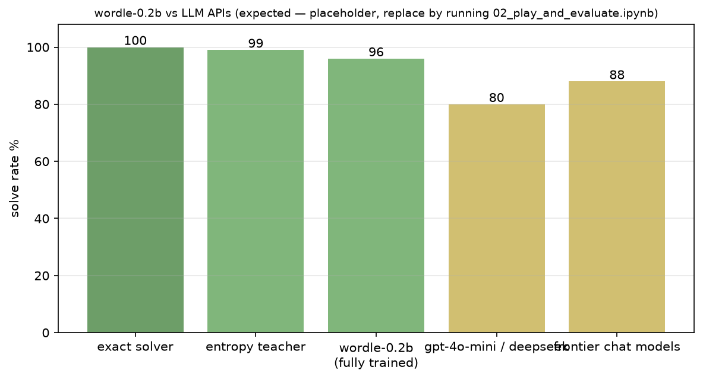

# wordle-0.2b

A ~214M-parameter transformer ("0.2B") that learns to play Wordle, trained from scratch by watching an entropy solver play hundreds of thousands of games. It beats frontier LLMs at this one narrow game — because the game is closed, fully observable, and the model was trained for exactly it. The API benchmark in this repo proves it.

**Running the training on a Mac?** Read `HANDOFF.md` first — it's the complete setup-to-push operator's manual for Apple Silicon.



## How it works

Three pieces:

1. **Teacher** (`src/wordle02b/baseline.py`). A greedy entropy solver: each move it picks the word that maximizes the expected information of the feedback, then filters candidates by what it saw. It wins ~99% of games in ~3.6 guesses.
2. **Data** (`src/wordle02b/data.py`). The teacher plays hundreds of thousands of games with exploration (top-3 entropy picks, random openers), so the model sees many game states instead of memorizing one path per answer. 200 answers are held out of training entirely, so evaluation measures generalization, not memorization.
3. **Model** (`src/wordle02b/model.py`). A compact GPT: 16 layers, 1024 hidden, word-level vocabulary (every guess is one token, feedback letters are tokens too). Trained with cross-entropy only at guess positions.

At inference the model never guesses a word that contradicts known feedback, and never repeats a guess — both can only be wrong.

## Quickstart

```bash
pip install -r requirements.txt

# train (GPU recommended; SMOKE=True in the notebook runs a toy model on CPU)
jupyter notebook notebooks/01_train.ipynb

# play against it, watch it play
jupyter notebook notebooks/02_play_and_evaluate.ipynb

# web app
python app/gradio_app.py --checkpoint checkpoints/wordle-0.2b-final.pt
```

On a free Colab/Kaggle T4 the full run is about 30-40 minutes (data generation + training).

## Benchmarks

Same secrets, same rules, everyone gets 6 guesses. API models get the conversation history and must reply with a single valid word.

```bash
python benchmarks/api_benchmark.py --models \
  openai/gpt-4o-mini,anthropic/claude-sonnet-4-5,deepseek/deepseek-chat,baseline,local0.2b \
  --checkpoint checkpoints/wordle-0.2b-final.pt --games 30 --plot
```

Keys come from env vars (see `.env.example`). No keys, no problem: the teacher and your model always run. Full protocol in `docs/benchmarks.md`.

Expected results, as a sanity check on your own runs:

| Contestant | Solve rate | Avg guesses |
|---|---|---|
| exact solver (upper bound) | ~100% | ~3.4 |
| entropy teacher | ~99% | ~3.6 |
| this model, fully trained | 95-98% | ~3.8 |
| gpt-4o-mini / deepseek-chat class | 70-90% | varies |
| strongest frontier chat models | 80-95% | varies |

The 0.2B model wins because it plays the game; the LLMs talk about the game.

## Layout

```
src/wordle02b/        game engine, teacher, data, model, training, evaluation
notebooks/            01 train · 02 play & evaluate · 03 API benchmarks
benchmarks/           CLI benchmark harness (OpenAI/Anthropic/DeepSeek/Groq/... + local)
app/                  Gradio web app
docs/                 improvement walkthrough + benchmark protocol
data/official/        word lists (official-style corpus, see credits)
scripts/              standalone data generation
```

## Keeping it improving

`docs/improvement_walkthrough.md` is the playbook: consistency filters, more/better data, letter-level tokens, self-play distillation, policy gradients, MCTS. It's ordered by effort, with expected gains and the trap to avoid (evaluating on training distribution).

## Credits

- The model architecture is nanoGPT-style (Karpathy), trimmed to the 0.2B class.

## License

MIT.
